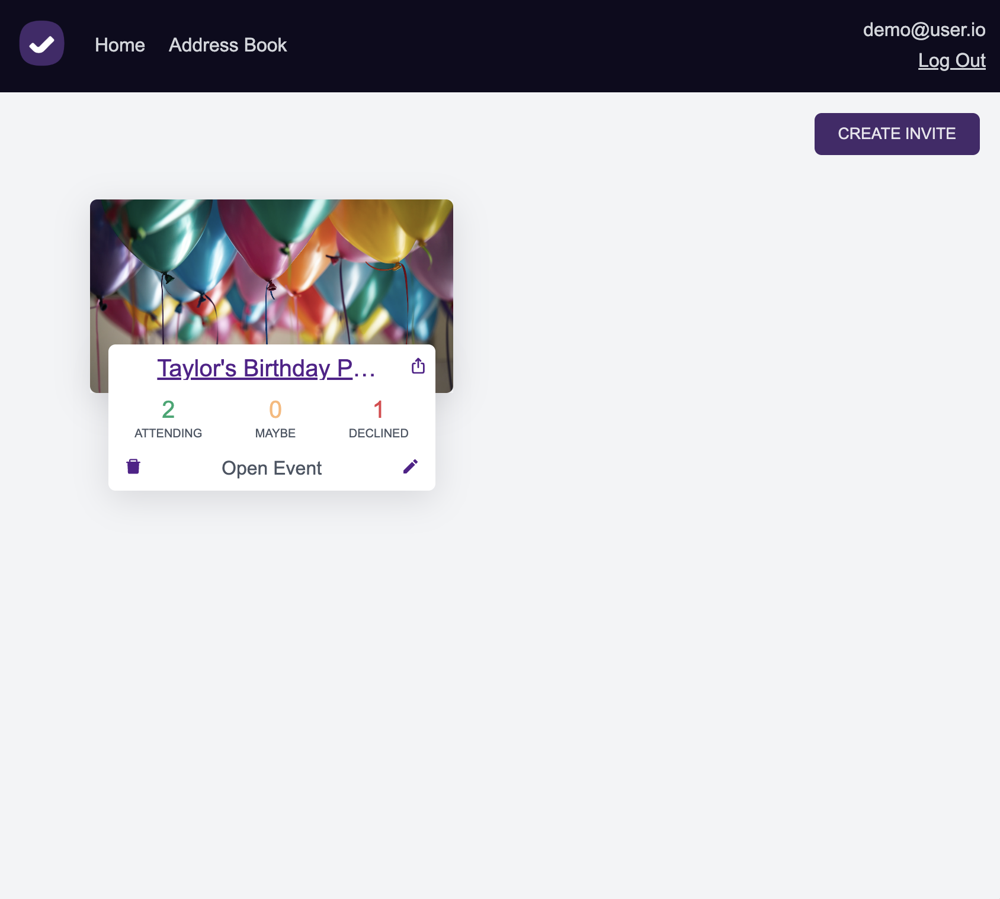
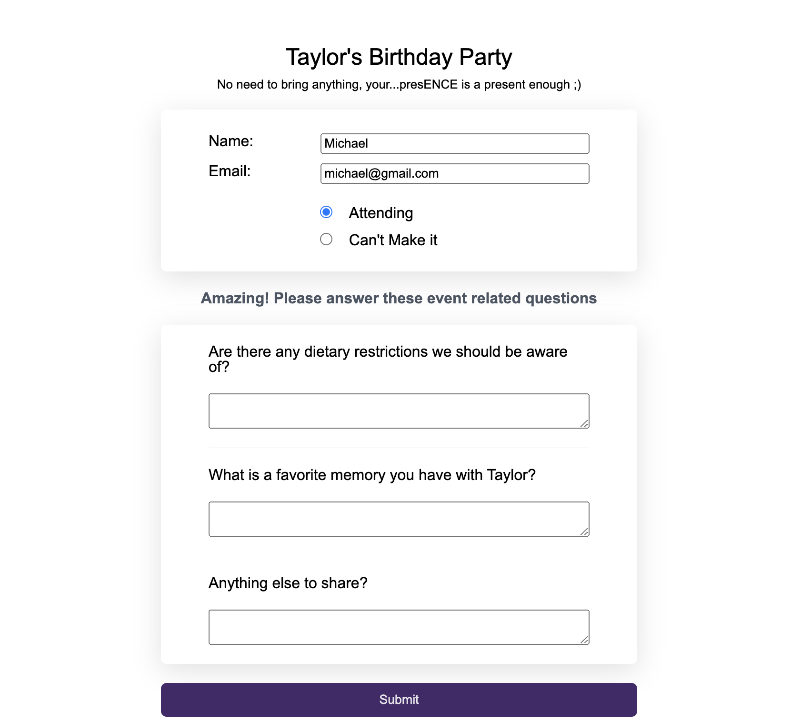
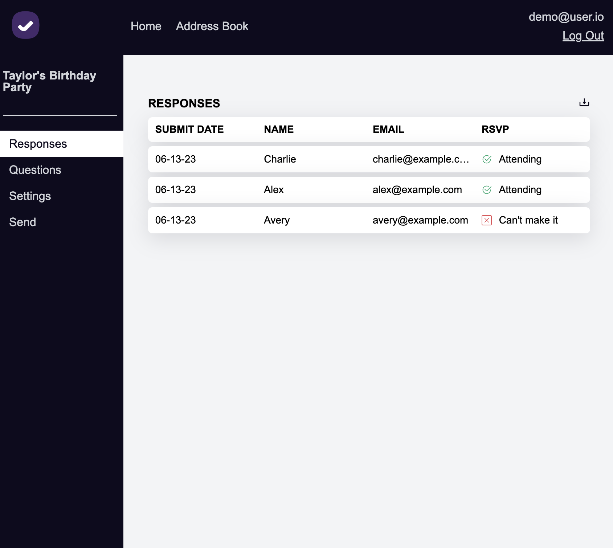

# bThere - [Live Site](https://b-there.herokuapp.com/)
Create events, send customized invitation forms, and track responses with bThere, an RSVPify inspired full stack event management suite powered by Rails, React/Redux, PostgreSQL, AWS, HTML5, and CSS3.

&nbsp;&nbsp;&nbsp;&nbsp;&nbsp;&nbsp;
 
## Getting Started
### Create Event
Upon logging in, create a new event from the forms page, providing the following:
- an event title
- an event description (optional)
- an event photo (optional)
If you'd like to restrict your invitation to only be viewed by specific guests, select the invite only option.
### Modify Event
Once you've created an event, the fun really begins! You can:
- add and edit supplementary questions for your guests to answer in addition to marking their attendance
- designate which of your contacts will be able to view and respond to the invitation (if it is an invite only event)
- update the title, description, and privacy of your event as needed
### Send Invitation
Once you've customized the invitation to your liking, copy your invitation link and share it how you see fit!
### View Responses
View the respsonses as they come in on the invitation response page, which summarizes each guests attendance status. Download the responses to view the answers to supplementary questions.

## Technlogies
bThere is a full stack application utilizing:
- Ruby on Rails to manage the back end
- React/Redux to manage all the complexities of event management
- AWS for photo storage
- PostgreSQL for database management
- Jbuiler for api only back end routes

## Features
bThere's end to end event management capabilities enables you to:
- create an event and upload an event photo to be associated with your invitation
- create an unlimited number of supplemental short answer questions for guests to answer
- create and manage a guest list for each event, preventing non-guests from viewing the invitation
- view and download responses to csv format
- manage events on desktop and mobile, due to its **responsive** design

## Technical Feats
### Dynamic I/O Processing
bThere's invitation configurator allows the user to create an arbitrary number of short answer questions later rendered to, and answered by, guests. Breaking the traditional paradigm of a form collecting a pre-determined set of inputs.

The ResponsePage and ResponsePane components work in tandem to enable the dynamic rendering of host-created question from the database and storage of their corresponding responses.

The ResponsePage component, responsible for rendering the full set of supplemental questions, creates a state variable to store references to the supplemental questions.

```javascript
export default function ResponsePage(props) {

const [refs, setRefs] = useState({}); ...
```

The listQuestions function maps through the event's supplemental questions, generating a corresponding ResponsePane, providing it question details and the reference variable declared earlier.
```js
function listQuestions() {
    if (attendStatus === "accept" && questions.length > 0) {
        return (<>
            <div className="ql-header">
                {questions.length > 0 ? "Amazing! Please answer these event related questions" : null}
            </div>
            <div className="ql-added-questions no-gap">
                {questions.map((q) => {
                    return (
                        <ResponsePane key={q.id} question={q} setRefs={setRefs} refs={refs} />
                    )
                })}
            </div>
        </>)
    }
}
```

The ResponsePane component creates a controlled input for the question, and inserts a reference to it within the refs object, utilizing the spread operator to avoid overwriting any previous questions.
```js
export default function ResponsePane ({question, setRefs, refs}) {

    const [response, setResponse] = useState("");
    const inputRef = useRef();

    useEffect(()=> {
        setRefs((prevRefs) => ({...prevRefs, [question.id]: inputRef}));
    }, [])

    return (<div className="rpane-wrapper">
        <label htmlFor={question.id}>{question.prompt}</label>
        {question.description}
        <textarea ref={inputRef} id={question.id} data-question-id={question.id}
        value={response} onChange={(e) => {setResponse(e.target.value)}}/>
        </div>
    );
}
```
Back in the ResponsePage component, postResponse runs once the guest submits their responses. This function validates that they have at least indicated their attendance (required) and then iterates through the refs object that contains the references to every ResponsePane question, packaging it up in a submission object passed to the back end. 
```js
function postResponse() {
        if (!attendStatus) {
            setSubmitMsg("Please indicate your attendance!");
            return null;
        } else if (!name || !email) {
            setSubmitMsg("Please enter name and email!");
            return null;
        }

        const keys = Object.keys(refs);
        const submission = {
            submission:
            {
                formId,
                name,
                email,
                status: attendStatus,
                responses: []
            }
        }

        if (keys.length > 0 && refs[keys[0]].current) {
            keys.forEach(key => {
                const ref = refs[key];
                submission['submission']['responses'].push({ questionId: ref.current.dataset.questionId, answer: ref.current.value })
            });
        }
        
        //no need to utilize redux, as this data should only be sent to the db, not ever displayed back to a guest
        csrfFetch('/api/submissions', {
            method: 'POST',
            body: JSON.stringify(submission)
        }).then((data) => {
            setSubmitted(true);
        })
    }
```

### Highly Versatile Components
bThere places an outsized emphasis on highly versatile components, allowing for more streamlined, flexible, maintainable code. Several components can each render distinct pages with their own capabilities. For example:
- the AuthFormPage component powers both the login and signup pages
- the FormCreatePage component powers both the form create and login pages
- the ContactsPage component powers both the Address Book and Invite List pages
- the TableRow component is responsible for rendering tables of arbitrary length with a consistent design across several components
Creating these highly versatile components involved a higher degree of up front work, that now pays dividends in terms of maintanability. The ContactsPage was particularly challenging to design given the significant differences in data availability between the Address Book and Invite List pages.

The Address Book allows the user to manage a singular contact list associated with their account. The Invite List similarly displays the user's contact list, but within the context of a **specific event**, allowing the user to invite or disinvite that contact from the event.

Enabling a single component to power both of these distinct use cases involved designing a highly flexible back end controllers paired with an equally flexible back end.

The ContactsPage first checks the params for a formId, which would indicate the user is viewing the contact list in the context of an invitation, rather than the global list of contacts. It then sets the headers of the table to be rendered accordingly, including an "INVITED" column if there is an invitation and it is also a private event.
```js
export default function ContactsPage() {

    const { formId } = useParams();
    const form = useSelector(selectForm(formId));
    
    const [header, setHeader] = useState([])
    
    useEffect(() => {
        if (form && form.restricted) {
            setHeader(["INVITED", "NAME", "EMAIL","MODIFY"
            ])
        } else {
            setHeader(["NAME","EMAIL","MODIFY"
            ])
        }
    }, [form])
    ...
```
That header is utilized to render the head of the table.
```js
return (
    ...
        <TableRow rowContent={header} />
        {contacts.map((c) => {
            return (
                <ContactModifier key={c.id} contact={c} form={form} />
            )
        })}
    ...
}
```
The ContactModifier component generates and populates the table contents, determining whether to include an invitation column based on the presence of an invite only form. A click of the invitation checkbox triggers either the deletion or creation of an invitation.
```js
export default function ContactModifier({ contact, form }) {

    const dispatch = useDispatch();
    let rowContent;

    if (form && form.restricted) {
        rowContent = [
            <input type="checkbox" checked={invited(contact)} onChange={handleInviteChange} />,
            contact.name,
            contact.email,
            <div className="contact-delete-icon" onClick={() => { dispatch(deleteContact(contact.id)) }}><AiFillDelete /></div>
        ]
    } else {
        rowContent = [
            contact.name,
            contact.email,
            <div className="contact-delete-icon" onClick={() => { dispatch(deleteContact(contact.id)) }}><AiFillDelete /></div>
        ]
    }

    function handleInviteChange(e) {
        if (e.target.checked) {
            const newInvite = {
                formId: form.id,
                contactId: contact.id
            }
            dispatch((postInvite(newInvite)))
        } else {
            dispatch(deleteInvite(contact))
        }
    }

    function invited(contact) {
        if (contact.formId) {
            return (contact.formId.toString() === form.id.toString())
        } else {
            return false
        }
    }

    return (
        <TableRow rowContent={rowContent} />
    )
}
```
This front end experience presents challenges for the back end, as contacts and invites involve distinct tables and a single contact can be associated with MANY events. Rather than create separate custom routes, with duplicative code, the single Contact index route handles both types of requests by toggling the ActiveRecord query based on the presence of a form.

In the case of a form, the query performs a join between the contacts and invitations tables, filtering out non-matching forms.
If there is no form, the query inserts null values for invite related information so a single view template can handle the rendering.
```rb
# Contacts Controller, Index action
def index
...
    if(form)
        get_invitation = true;

        query = <<-SQL
        select
        c.*,
        i.form_id,
        coalesce(i.id, -1) as invite_id
        from contacts as c
        left join invites as i on i.contact_id = c.id
        where i.form_id = ? OR i.form_id IS null
        and c.user_id = ?
        SQL

        @contacts = Contact.find_by_sql([query, form_id, current_user.id])
    else
      query = <<-SQL
        select
        c.*,
        case when true then null end as form_id,
        case when true then null end as invite_id
        from contacts as c
        where c.user_id = ?
      SQL
      @contacts = Contact.find_by_sql([query, current_user.id])
    end
    render '/api/contacts/index'
  end
```
This single template can handle all contact requests, regardless of whether they involve invitations.
```rb
# contacts > index.json.jbuiler
@contacts.each do |contact|
    json.set! contact.id do
        json.extract! contact, :id, :email, :name, :form_id, :invite_id
    end
end
```

Therefore the front end stats appears as follows when the user is on the global contacts page. The null inviteId value indicates that an invitation column with add/delete capabilities should not be rendered.
```js
//state at /address-book
contacts: {
    1: {id: 1, email: 'johnsmith@gmail.com', name: 'John Smith', inviteId: null},
    2: {id: 2, email: 'janesmith@gmail.com', name: 'Jane Smith', inviteId: null}
}
```
On the invitation page, the state updates to populate the InviteId with a value of -1 denoting the contact is not invited and their invitation ID otherwise.
```js
//state at /forms/invite-list
contacts: {
    1: {id: 1, email: 'johnsmith@gmail.com', name: 'John Smith', inviteId: -1},
    1: {id: 2, email: 'janesmith@gmail.com', name: 'Jane Smith', inviteId: -1}
}
```
Though this data flow involved more up front design, it enables a single pair of front and back end interfaces to power multiple pages with distinct capabilities.
